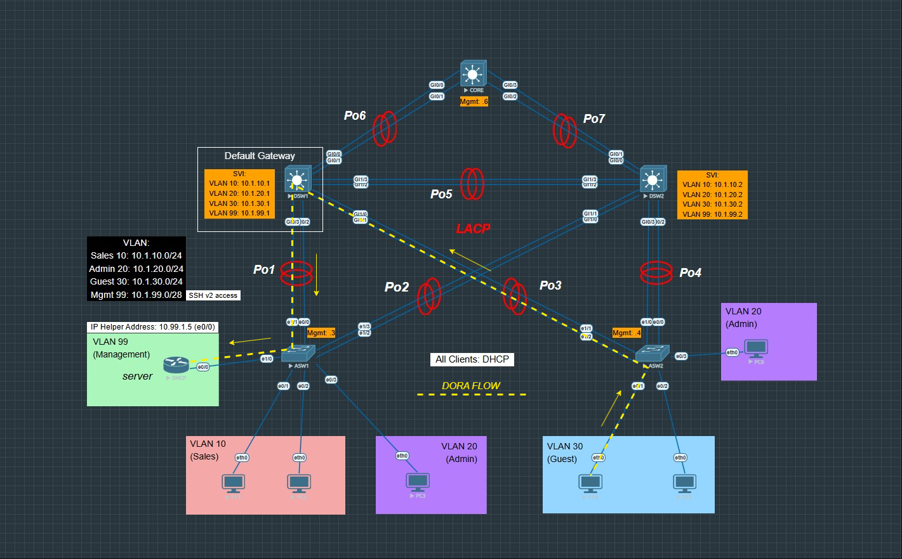

Layer 2 Switching Lab: VLANs, EtherChannel, and DHCP
--------------------------------------------------------------------------------------------------
This lab simulates a small enterprise Layer 2 network using EVE-NG. It includes multiple VLANs, dynamic host configuration, inter-switch trunking with EtherChannel (LACP), and remote SSH access for switch management.
--------------------------------------------------------------------------------------------------
Device Images Used

Device Type	Image Used

L3 Switches	vios-adventerprisek9-m

L2 Switches	viosl2-adventerprisek9-m

Router (DHCP)	vios-adventerprisek9-m

VPC Hosts	vpcs

--------------------------------------------------------------------------------------------------
Network Overview

The topology is built using a three-layer architecture:

	Core Layer: Connects the two distribution switches and provides a centralized management SVI.

	Distribution Layer (DSW1, DSW2): These switches host the VLAN interfaces (SVIs) and act as the 	default gateways for the client devices.

	Access Layer (ASW1, ASW2): Client PCs connect here via access ports and receive IPs via DHCP. The 	DHCP server (router) is also connected here.

All four main VLANs are used:

	VLAN 10 (Sales) — 10.1.10.0/24

	VLAN 20 (Admin) — 10.1.20.0/24

	VLAN 30 (Guest) — 10.1.30.0/24

	VLAN 99 (Management) — 10.1.99.0/28

All hosts get their IP addresses dynamically via a central DHCP server.
--------------------------------------------------------------------------------------------------
Spanning-Tree (PVST)

DSW1 has been configured as the root bridge for VLANs 10,20.
DSW2 has been configured as the root bridge for VLANs 30,99.
--------------------------------------------------------------------------------------------------
Routing & Addressing

The DHCP server (router) is connected to the network through ASW1 and is configured with IP address 10.1.99.5 on interface e0/0. This IP is also used in the ip helper-address configuration on the SVIs.

Each SVI is assigned as follows:

	DSW1: .1 addresses for each VLAN

	DSW2: .2 addresses

	ASW1 and ASW2: .3 and .4 on VLAN 99 only (for SSH)

	Core: .6 on VLAN 99 (management only)
--------------------------------------------------------------------------------------------------
SSH Access

Remote SSH access is enabled for all switches using their VLAN 99 IPs. Local user authentication is configured, and ip domain-name and RSA key generation were done. SSH v2 is enforced.
--------------------------------------------------------------------------------------------------
EtherChannel & Trunking

All switch-to-switch links use LACP-based EtherChannels (Po1 through Po7) with trunk mode enabled. VLANs 10, 20, 30, and 99 are allowed on all trunks.
--------------------------------------------------------------------------------------------------
DHCP Relay

DHCP broadcasts are forwarded to the central server using the ip helper-address command on each SVI. The DHCP server assigns IPs to all VLANs using configured pools.
--------------------------------------------------------------------------------------------------

Notes:

Port security was not explicitly configured in this lab.

